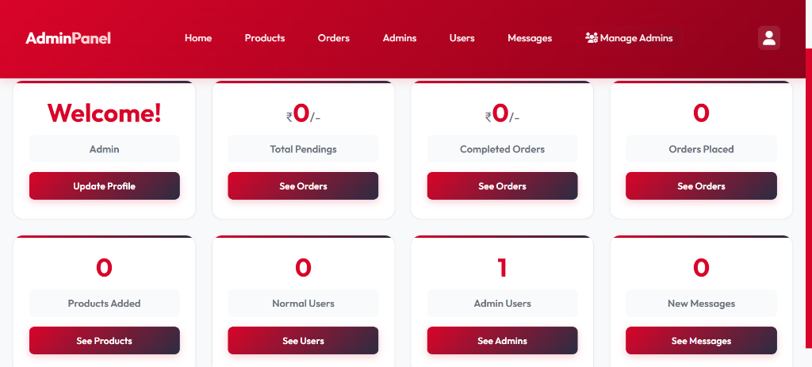

[](http://cart-deal.wuaze.com/home.php)
[](#security-features)
[](#design-philosophy)

**Cart-deal** is a high-performance, visually stunning e-commerce solution. It combines a minimalist frontend aesthetic with a robust administrative backend, featuring a unified **Red, Black, and White** theme, modern typography, and pixel-perfect SVG iconography.

---

## 🔗 Live Demo
Access the live version of the project here: [**cart-deal.wuaze.com**](http://cart-deal.wuaze.com/home.php)

## 📸 Project Gallery

### 🌐 Frontend Interface
*Standard User View - Minimalist & Elegant*
 
> [!NOTE]
> Screenshot of the main landing page showcasing the Signature Collections and modern Red-Black theme.

### ⚙️ Admin Panel
*Administrative Control Center*
 
> [!NOTE]
> Screenshot of the Admin Dashboard featuring real-time statistics and unified branding.

---

## 🔐 Admin Credentials

To access the administrative features, use the following default Superadmin credentials:

| Role | Email | Password |
| :--- | :--- | :--- |
| **SuperAdmin** | `admin@cartdeal.local` | `admin` |

> [!IMPORTANT]
> Change the default passwords immediately after your first login for security.

---

## 🚀 How to Run the Project

### Prerequisites
- **XAMPP / WAMP / MAMP** (Recommended for local hosting)
- **PHP** >= 8.0
- **MySQL** Server

### Step-by-Step Installation

1. **Clone the Project:**
   Place the project folder inside your web server's root directory:
   - For XAMPP: `C:\xampp\htdocs\Cart-deal`
   - For WAMP: `C:\wamp64\www\Cart-deal`

2. **Database Setup:**
   - Open **phpMyAdmin** (`http://localhost/phpmyadmin`).
   - Create a new database named `Ecommerce_db`.
   - Click on the `Import` tab and upload the `Ecommerce_db.sql` file provided in the root directory.

3. **Configure the Application:**
   - Navigate to `components/` folder.
   - Rename `config.php.example` to `config.php`.
   - Open `config.php` and update your database credentials if different from defaults:
     ```php
     define('DB_HOST', 'localhost');
     define('DB_NAME', 'Ecommerce_db');
     define('DB_USER', 'root');
     define('DB_PASS', '');
     ```

4. **Launch the Website:**
   - Open your browser and go to: `http://localhost/Cart-deal/home.php`
   - For the Admin Panel: `http://localhost/Cart-deal/admin/admin_login.php`

---

## ✨ Key Features

### 🛍️ User Experience (Frontend)
- **Signature Collections:** 8 custom-coded **SVG categories** ensuring zero-blur transparency.
- **Dynamic Search:** Real-time Trie-based search suggestions.
- **Premium Typography:** High-end **'Outfit'** font family.
- **Compact Footer:** Optimized 4-column pattern for all devices.

### 🔐 Administration (Backend)
- **Unified Branding:** Red-Black theme parity with the frontend.
- **Role-Based Access:** Standard Admin and Superadmin hierarchical permissions.
- **Inventory Control:** Full visual CRUD for products and categories.
- **Security:** Bcrypt password hashing and global XSS protection.

---

## 🛡️ Security Features
- **SQLi Protection:** Prepared statements via PDO.
- **XSS Prevention:** Global output filtering.
- **Bcrypt Hashing:** Modern, secure password storage.
- **Cache Control:** CSS versioning stickers to bypass browser caching.

---

<p align="center">Made with ❤️ for a better shopping experience</p>